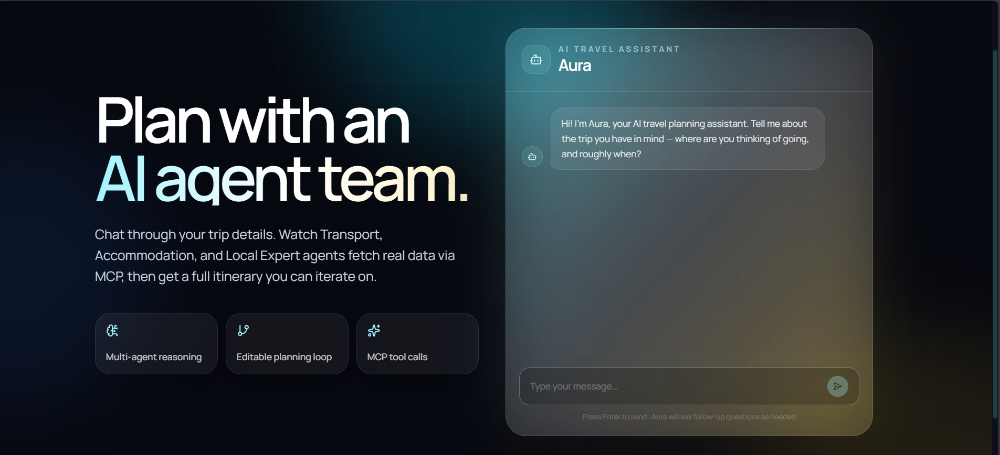
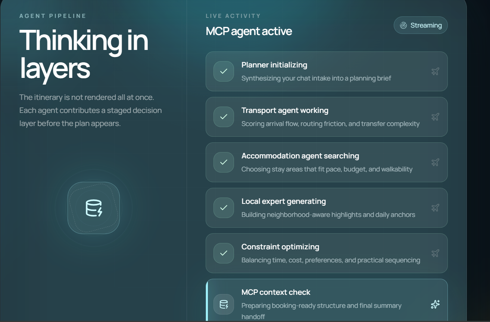
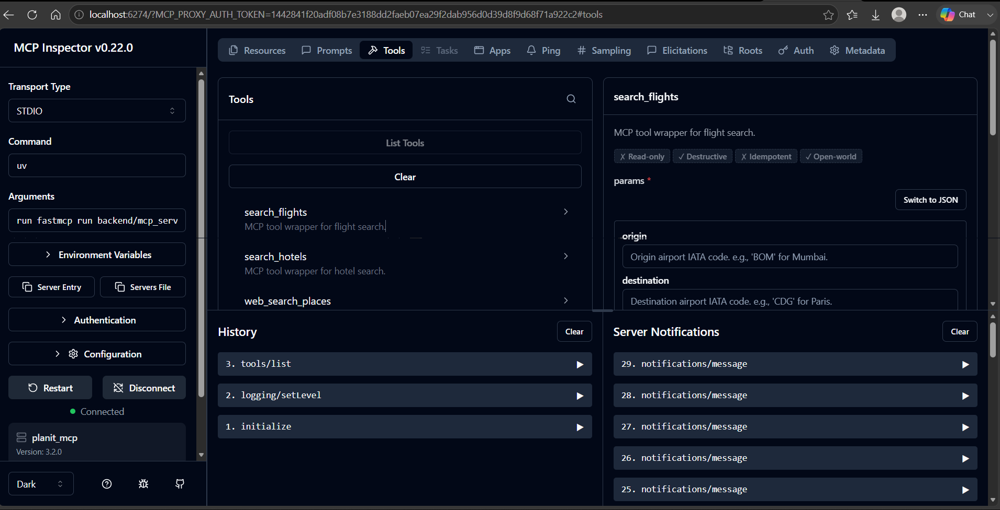

<div align="center">
  <h1>🌍 PlanIT</h1>
  <p><strong>MCP-Orchestrated Multi-Agent Travel Planning System</strong></p>
  
  <p>
    
    
    
    
    
  </p>
</div>

<br />

## ✨ Overview

**PlanIT** is an intelligent travel planning platform powered by autonomous AI agents coordinated through **LangGraph** and real-world tools accessed via the **Model Context Protocol (MCP)**. 

Unlike traditional chatbots, PlanIT gathers travel requirements, retrieves live data (flights, hotels, attractions), generates optimized itineraries, and simulates booking—all through a collaborative team of specialized AI agents.

---

## 🎨 User Experience

PlanIT features a premium, modern AI interface built with Next.js, TailwindCSS, ShadCN UI, and Framer Motion. 

### 1. The Planning Interface
A conversational and beautiful landing page where you interact with **Aura**, your AI travel assistant.

<div align="center">
  
  <p><em>Chat through your trip details with Aura.</em></p>
</div>

### 2. Multi-Agent Reasoning (Thinking in Layers)
Watch the system "think" as specialized agents (Transport, Accommodation, Local Expert, and Constraint) process your request layer by layer.

<div align="center">
  
  <p><em>Real-time streaming of agent pipeline activities.</em></p>
</div>

### 3. Under the Hood: MCP Inspector
A single FastMCP server exposes external APIs (AeroDataBox, Booking.com, Tavily) to the agent team without direct LLM API calls.

<div align="center">
  
  <p><em>The MCP Inspector portal showing active tools like search_flights and search_hotels.</em></p>
</div>

---

## 🤖 Agent Architecture

PlanIT utilizes a multi-agent orchestration approach using **LangGraph**:

- 🎙️ **Greeting Agent:** Collects user inputs (destination, dates, budget, preferences).
- 🧠 **Planning Agent:** The central orchestrator that analyzes user intent and routes tasks.
- ✈️ **Transport Agent:** Generates flight search parameters and calls the `search_flights` MCP tool.
- 🏨 **Accommodation Agent:** Generates hotel search parameters and calls the `search_hotels` MCP tool.
- 🗺️ **Local Expert Agent:** Finds unique attractions using the `web_search_places` MCP tool.
- ⚖️ **Constraint / Itinerary Agent:** Validates budgets, dates, and assembles the final day-by-day itinerary.
- 💳 **Payment Agent:** Simulates travel booking confirmation and summaries.

---

## 🛠️ Technology Stack

| Domain | Technologies |
| --- | --- |
| **Backend** | Python 3.12, FastAPI, Uvicorn, LangGraph, LangChain (OpenAI gpt-4o-mini) |
| **Frontend** | Next.js 14+ (App Router), TailwindCSS, ShadCN UI, Framer Motion |
| **Tooling Protocol** | FastMCP (Python SDK) |
| **External APIs** | AeroDataBox (Flights), Booking.com (Hotels), Tavily (Web Search) |

---

## 🚀 Quick Start

### Prerequisites
- Python 3.12+ (via `uv`)
- Node.js 18+
- API Keys: OpenAI, AeroDataBox, Booking.com, Tavily

### 1. Environment Setup
Create a `.env` file in the root directory:
```bash
OPENAI_API_KEY=your_key
AERODATABOX_API_KEY=your_key
BOOKING_COM_API_KEY=your_key
TAVILY_API_KEY=your_key
```

### 2. Run the MCP Server
Start the tool server that securely connects to external APIs.
```bash
uv run python -m backend.mcp_servers.server
```

### 3. Start the Backend API
Run the LangGraph + FastAPI orchestrator.
```bash
uv run uvicorn backend.main:app --reload --port 8000
```

### 4. Start the Frontend
Launch the Next.js UI.
```bash
cd frontend
npm install
npm run dev
```

---

<div align="center">
  <p>Built with ❤️ using LangGraph and Model Context Protocol</p>
</div>
